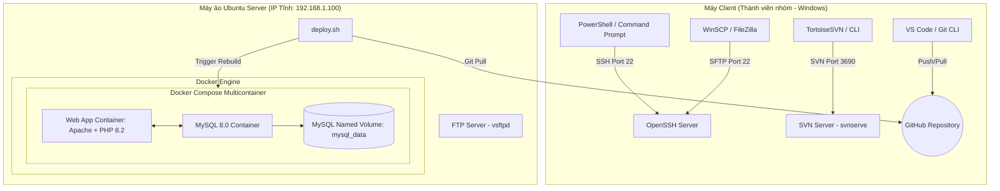

# BÁO CÁO TOÀN DIỆN TRIỂN KHAI, QUẢN TRỊ HỆ THỐNG & KỊCH BẢN VẤN ĐÁP
## MÔN: QUY TRÌNH VÀ CÔNG CỤ PHÁT TRIỂN PHẦN MỀM (UTT)

---

## 📑 PHẦN I: KIẾN TRÚC HỆ THỐNG & HẠ TẦNG TRIỂN KHAI

### 1. Kiến trúc tổng thể hệ thống (System Architecture)
Dự án **web_qlsp** (Quản lý sản phẩm quần áo) được triển khai trên nền tảng ảo hóa Linux (Ubuntu Server) sử dụng Docker Container để đóng gói đa dịch vụ. 



### 2. Cấu hình máy chủ ảo Ubuntu Server (VMware / VirtualBox)
* **Hệ điều hành:** Ubuntu Server 24.04 LTS (hoặc 22.04 LTS).
* **Thông số phần cứng máy ảo:**
  * **CPU:** 2 vCPUs
  * **RAM:** 2 GB
  * **Ổ cứng:** 20 GB (chọn chế độ *Store virtual disk as a single file* để tối ưu hóa I/O).
  * **Card mạng:** **Bridged Mode** (Cầu nối) để máy chủ nhận IP trực tiếp từ Router LAN, cùng dải IP với máy thật của các thành viên.

#### Cấu hình IP Tĩnh qua Netplan (Ubuntu Server):
Mở file cấu hình mạng (thay tên card mạng tương ứng, ví dụ `ens33`):
```bash
sudo nano /etc/netplan/50-cloud-init.yaml
```
Nội dung file cấu hình:
```yaml
network:
  ethernets:
    ens33:
      dhcp4: no
      addresses:
        - 192.168.1.100/24
      routes:
        - to: default
          via: 192.168.1.1
      nameservers:
        addresses:
          - 8.8.8.8
          - 1.1.1.1
  version: 2
```
Áp dụng cấu hình:
```bash
sudo netplan apply
```

---

## 🛠️ PHẦN II: CẨM NANG CÂU LỆNH QUẢN TRỊ HỆ THỐNG CHI TIẾT (CHEAT SHEET)

> [!IMPORTANT]
> Đây là tài liệu tra cứu nhanh toàn bộ các lệnh quan trọng cần thiết cho lập trình viên DevOps, quản trị hệ thống và thành viên dự án.

---

### 🐳 1. DOCKER & DOCKER COMPOSE (Đóng gói & Chạy đa container)

Docker giúp cô lập môi trường ứng dụng Web (PHP/Apache) và Database (MySQL) để đảm bảo tính đồng nhất.

#### a. Quản lý Container
| Câu lệnh | Giải thích & Ví dụ thực tế |
| :--- | :--- |
| `docker ps` | Liệt kê các container đang chạy trong hệ thống. |
| `docker ps -a` | Liệt kê toàn bộ container (bao gồm cả container đã dừng). |
| `docker run -d -p 8080:80 --name web_app php:8.2-apache` | Khởi chạy container mới ở chế độ chạy ngầm (`-d`), map cổng 8080 host vào 80 container. |
| `docker stop <container_name/ID>` | Dừng một container đang chạy (Ví dụ: `docker stop web_qlsp_app`). |
| `docker start <container_name/ID>` | Khởi chạy lại một container đã bị dừng trước đó. |
| `docker restart <container_name/ID>` | Tái khởi động nhanh một container. |
| `docker rm <container_name/ID>` | Xóa bỏ một container đã dừng. Dùng `docker rm -f` để cưỡng chế xóa container đang chạy. |
| `docker logs -f --tail 100 <container_name>` | Xem log thời gian thực (`-f`) và hiển thị 100 dòng cuối của container (Ví dụ: `docker logs -f web_qlsp_app`). |
| `docker exec -it web_qlsp_db mysql -u root -p` | Truy cập tương tác (`-it`) vào console MySQL bên trong container database để quản trị trực tiếp. |
| `docker exec -it web_qlsp_app /bin/bash` | Truy cập trực tiếp vào shell bash của container web để kiểm tra file hệ thống. |
| `docker cp <local_path> <container_id>:<dest_path>` | Sao chép file từ máy chủ vật lý vào trong container (hoặc ngược lại). |

#### b. Quản lý Images
| Câu lệnh | Giải thích & Ví dụ thực tế |
| :--- | :--- |
| `docker images` | Hiển thị tất cả các Docker Images hiện có trên máy chủ. |
| `docker build -t web_qlsp_image:1.0 .` | Đọc Dockerfile tại thư mục hiện tại (`.`) để đóng gói thành Docker Image với tag chỉ định. |
| `docker rmi <image_name/ID>` | Xóa một Docker Image khỏi hệ thống. |
| `docker image prune -f` | Xóa bỏ toàn bộ các image rác (dangling images - không có tên/tag) sinh ra khi build lại nhiều lần. |

#### c. Quản lý Volumes (Dữ liệu bền vững) & Networks
| Câu lệnh | Giải thích & Ví dụ thực tế |
| :--- | :--- |
| `docker volume ls` | Liệt kê tất cả các Docker Volume lưu trữ dữ liệu. |
| `docker volume inspect mysql_data` | Xem chi tiết thông số và vị trí mount thực tế trên ổ cứng máy chủ của Volume `mysql_data`. |
| `docker volume rm <volume_name>` | Xóa Volume lưu trữ (Lưu ý: Chỉ xóa được khi không có container nào đang sử dụng volume này). |
| `docker network ls` | Liệt kê các mạng ảo được Docker khởi tạo. |
| `docker network inspect <network_name>` | Kiểm tra thông tin các container đang kết nối chung trong mạng ảo. |

#### d. Điều khiển Docker Compose (Triển khai đa dịch vụ)
| Câu lệnh | Giải thích & Ví dụ thực tế |
| :--- | :--- |
| `docker compose up -d` | Khởi chạy toàn bộ hệ thống container được định nghĩa trong `docker-compose.yml` ở chế độ ngầm. |
| `docker compose up -d --build` | Ép buộc build lại Dockerfile và khởi chạy lại hệ thống container. (Thường dùng khi cập nhật code). |
| `docker compose down` | Dừng và xóa sạch các container, network ảo được tạo bởi compose (không mất dữ liệu volume). |
| `docker compose down -v` | Dừng, xóa container, network và **xóa sạch toàn bộ dữ liệu Volume** (Đưa database về trạng thái trống). |
| `docker compose ps` | Xem trạng thái hoạt động của các container do compose quản lý. |
| `docker compose logs -f` | Xem log tổng hợp của tất cả các container chạy trong cụm compose. |
| `docker compose restart web` | Tái khởi động duy nhất service `web` trong cụm dịch vụ. |

---

### 📂 2. SVN - SUBVERSION (Quản lý tài liệu và tài nguyên nhị phân lớn)

SVN được dùng song song với Git để lưu trữ các tài liệu đặc tả, thiết kế (.docx, .pdf, .fig, .xlsx) để tránh làm nặng lịch sử phân tán của Git.

#### a. Câu lệnh dành cho Admin (Quản trị SVN Server)
| Câu lệnh | Giải thích & Ví dụ thực tế |
| :--- | :--- |
| `svnadmin create /var/svn/project_docs` | Khởi tạo một Repository SVN mới trên máy chủ tại đường dẫn `/var/svn/project_docs`. |
| `svnserve -d -r /var/svn --log-file /var/log/svn.log` | Khởi chạy tiến trình dịch vụ SVN chạy ngầm (`-d`), lấy gốc thư mục là `/var/svn` (`-r`) và ghi log. |
| `killall svnserve` | Dừng hoạt động của dịch vụ SVN Server. |

#### b. Câu lệnh dành cho Client (Developer/Lập trình viên làm việc với SVN)
| Câu lệnh | Giải thích & Ví dụ thực tế |
| :--- | :--- |
| `svn checkout svn://192.168.1.100/project_docs .` | Tải (Clone) toàn bộ tài nguyên từ kho SVN trên Server về thư mục hiện tại của máy Client. |
| `svn update` | Cập nhật các file tài liệu mới nhất từ SVN Server về máy Client (tương tự `git pull`). |
| `svn add tailieu.docx` | Đăng ký một file tài liệu mới vào hàng đợi quản lý phiên bản của SVN. |
| `svn commit -m "Thêm file đặc tả yêu cầu"` | Đẩy trực tiếp các thay đổi lên kho lưu trữ SVN tập trung trên Server. |
| `svn status` | Kiểm tra trạng thái thay đổi các file tài liệu ở thư mục local (File nào đã sửa, file nào chưa add). |
| `svn log -l 10` | Xem lịch sử 10 commit gần nhất trên kho SVN. |
| `svn diff tailieu.docx` | So sánh sự khác biệt của nội dung file hiện tại so với phiên bản gần nhất trên server. |
| `svn revert tailieu.docx` | Hủy bỏ tất cả các chỉnh sửa cục bộ chưa commit của file và phục hồi về bản gốc. |
| `svn resolve --accept mine-full tailieu.docx` | Giải quyết xung đột bằng cách ưu tiên chọn hoàn toàn nội dung file trên máy mình. |
| `svn resolve --accept theirs-full tailieu.docx` | Giải quyết xung đột bằng cách ưu tiên ghi đè hoàn toàn bằng file tải về từ Server. |
| `svn info` | Hiển thị thông tin chi tiết về URL Server, phiên bản Revision hiện tại của kho chứa. |

---

### 🐙 3. GIT & GITHUB (Quản lý mã nguồn phần mềm)

Quy trình làm việc nhóm sử dụng Git Flow với nhánh chính ổn định (`main`), nhánh tích hợp liên tục (`develop`), và các nhánh tính năng của từng cá nhân (`trananh`, `myanh`, `leminh`, `baduy`, `huugiang`, `phuong`).

#### a. Khởi tạo & Cấu hình
| Câu lệnh | Giải thích & Ví dụ thực tế |
| :--- | :--- |
| `git init` | Khởi tạo một Git Repository trống tại thư mục hiện tại. |
| `git clone git@github.com:username/web_qlsp.git` | Sao chép mã nguồn dự án từ xa (GitHub) về máy tính cá nhân qua giao thức SSH. |
| `git config --global user.name "Nguyen Ba Duy"` | Thiết lập tên định danh của bạn khi commit code trên máy tính này. |
| `git config --global user.email "duy@example.com"` | Thiết lập email định danh cho tài khoản Git của bạn. |

#### b. Quản lý Thay đổi & Commit
| Câu lệnh | Giải thích & Ví dụ thực tế |
| :--- | :--- |
| `git status` | Xem trạng thái các file trong dự án (Unstaged, Staged, Untracked). |
| `git add .` | Đưa toàn bộ các file thay đổi vào khu vực chuẩn bị commit (Staging Area). Dùng `git add <file>` cho file cụ thể. |
| `git commit -m "feat(product): thêm bộ lọc sản phẩm theo giá"` | Ghi nhận các thay đổi vào lịch sử Git cục bộ kèm thông điệp chuẩn hóa. |
| `git commit --amend -m "Mô tả mới"` | Sửa đổi thông điệp commit hoặc bổ sung file vào commit gần nhất (chỉ dùng khi chưa push lên remote). |
| `git diff` | Xem chi tiết các dòng code đã sửa đổi so với phiên bản commit gần nhất. |
| `git diff develop main` | Xem sự khác biệt mã nguồn giữa nhánh phát triển `develop` và nhánh phát hành `main`. |

#### c. Quản lý Nhánh (Branching) & Đồng bộ
| Câu lệnh | Giải thích & Ví dụ thực tế |
| :--- | :--- |
| `git branch` | Liệt kê danh sách các nhánh đang có ở máy local. Thêm `-a` để xem toàn bộ nhánh trên remote. |
| `git checkout -b feature/login` | Tạo một nhánh mới tên là `feature/login` từ nhánh hiện tại và chuyển sang nhánh đó. |
| `git checkout develop` | Chuyển đổi sang làm việc trên nhánh có sẵn tên là `develop`. (Có thể dùng lệnh mới `git switch develop`). |
| `git branch -d feature/login` | Xóa nhánh `feature/login` sau khi đã merge code thành công vào develop. |
| `git pull origin develop` | Lấy code mới nhất từ nhánh `develop` trên GitHub và tự động gộp (merge) vào nhánh hiện tại. |
| `git push origin develop` | Đẩy toàn bộ commit ở nhánh `develop` từ máy cá nhân lên kho chứa trên GitHub. |
| `git fetch --all` | Tải thông tin tất cả các nhánh và commit mới từ GitHub về local nhưng chưa gộp vào code đang viết. |

#### d. Lệnh nâng cao, Hủy bỏ & Xử lý sự cố
| Câu lệnh | Giải thích & Ví dụ thực tế |
| :--- | :--- |
| `git merge develop` | Gộp code từ nhánh `develop` vào nhánh hiện tại (Tạo ra một commit merge chung). |
| `git rebase develop` | Gộp code từ develop vào nhánh hiện tại nhưng đặt các commit của bạn lên trên cùng (Lịch sử Git sẽ thẳng hàng). |
| `git cherry-pick <commit_hash>` | Lấy duy nhất một commit cụ thể từ một nhánh khác áp dụng vào nhánh hiện tại của bạn. |
| `git stash` | Lưu tạm thời các code đang viết dở (chưa muốn commit) vào bộ nhớ tạm để làm việc khác. |
| `git stash pop` | Lấy lại code đã lưu tạm trong stash ra để tiếp tục lập trình. |
| `git stash list` | Liệt kê danh sách các bản lưu tạm trong stash. |
| `git log --oneline --graph --all` | Hiển thị lịch sử commit dưới dạng sơ đồ nhánh rút gọn trực quan. |
| `git reset --hard HEAD~1` | Hủy bỏ hoàn toàn commit gần nhất và xóa sạch các code đã sửa đổi chưa lưu. (Rất nguy hiểm!). |
| `git reset --soft HEAD~1` | Hủy bỏ commit gần nhất nhưng vẫn giữ nguyên code đã viết trong Staging Area để sửa lại. |
| `git revert <commit_hash>` | Tạo ra một commit mới có nội dung ngược lại với commit chỉ định để hủy bỏ tác vụ mà không xóa lịch sử. |

---

### 🔑 4. SSH & SFTP (Truy cập quản trị & Truyền file an toàn)

Dùng giao thức SSH qua cổng 22 để quản trị hệ thống và truyền nhận tệp tin đã mã hóa an toàn.

#### a. Lệnh SSH
| Câu lệnh | Giải thích & Ví dụ thực tế |
| :--- | :--- |
| `ssh-keygen -t ed25519 -C "admin@utt.edu.vn"` | Sinh cặp khóa bảo mật SSH Key (Private/Public) dùng thuật toán Ed25519 hiện đại nhất. |
| `ssh admin@192.168.1.100` | Kết nối SSH vào máy chủ Linux bằng tài khoản `admin` thông qua cổng mặc định 22. |
| `ssh -p 2222 admin@192.168.1.100` | Kết nối SSH vào máy chủ Linux trong trường hợp đã đổi cổng dịch vụ sang cổng 2222. |
| `ssh-copy-id admin@192.168.1.100` | Tự động copy Public Key từ máy cá nhân vào file `~/.ssh/authorized_keys` của máy chủ để đăng nhập không cần mật khẩu. |
| `scp localfile.txt admin@192.168.1.100:/opt/web_qlsp/` | Sao chép nhanh file `localfile.txt` từ máy cá nhân lên thư mục `/opt/web_qlsp/` trên Server. |

#### b. Lệnh trong môi trường dòng lệnh SFTP
Sau khi kết nối bằng lệnh `sftp admin@192.168.1.100`, ta tương tác bằng các lệnh nội bộ:
* `pwd`: Xem thư mục hiện tại của bạn trên Server Linux.
* `lpwd`: Xem thư mục hiện tại của bạn trên máy thật Client (Windows).
* `ls`: Liệt kê danh sách file trong thư mục hiện tại của Server.
* `lls`: Liệt kê danh sách file trong thư mục cục bộ của máy Client.
* `cd /path`: Chuyển đổi thư mục làm việc trên Server.
* `lcd C:\Users\Downloads`: Chuyển đổi thư mục làm việc trên máy Client.
* `get remote_file.txt`: Tải file `remote_file.txt` từ Server Linux về máy Client.
* `put local_file.txt`: Tải file `local_file.txt` từ máy Client lên Server.
* `mkdir new_dir`: Tạo thư mục mới trên Server.
* `rm file_to_delete.txt`: Xóa file trên Server.
* `exit` hoặc `quit`: Thoát khỏi phiên kết nối SFTP.

---

### 📡 5. FTP - vsftpd (Truyền file truyền thống qua cổng 21)

Mặc dù SFTP bảo mật hơn, FTP vẫn được sử dụng trong các hệ thống cũ hoặc môi trường cục bộ hiệu năng cao.

#### a. Quản lý dịch vụ vsftpd trên Linux
| Câu lệnh | Giải thích & Ví dụ thực tế |
| :--- | :--- |
| `sudo systemctl status vsftpd` | Kiểm tra trạng thái hoạt động của dịch vụ FTP Server. |
| `sudo systemctl restart vsftpd` | Khởi động lại dịch vụ FTP Server để áp dụng cấu hình mới. |
| `sudo tail -f /var/log/vsftpd.log` | Xem trực tiếp log truyền tải dữ liệu và đăng nhập của người dùng qua FTP. |

#### b. Lệnh trong môi trường dòng lệnh FTP Client
Kết nối từ Client bằng lệnh `ftp 192.168.1.100`. Sau khi nhập User và Password, sử dụng các lệnh:
* `open 192.168.1.100`: Mở kết nối tới FTP Server nếu chưa kết nối ban đầu.
* `bin`: Chuyển sang chế độ truyền tải file nhị phân (Áp dụng cho ảnh, zip, exe, word, excel). **Rất quan trọng để tránh lỗi hỏng file**.
* `ascii`: Chuyển sang chế độ truyền tải văn bản thuần (Áp dụng cho file `.html`, `.txt`, `.php`).
* `put local_code.php`: Đẩy file từ client lên FTP Server.
* `get remote_code.php`: Lấy file từ FTP Server về client.
* `mput *.php`: Đẩy nhiều file PHP cùng lúc từ client lên server.
* `mget *.jpg`: Tải nhiều file ảnh JPG cùng lúc từ server về client.
* `prompt`: Bật/Tắt chế độ xác nhận từng file khi tải lên/xuống nhiều file (mget/mput).
* `bye` hoặc `quit`: Ngắt kết nối và thoát khỏi FTP Client CLI.

---

### 🐧 6. QUẢN TRỊ HỆ THỐNG LINUX & MẠNG (System & Network Administration)

Đây là các lệnh nền tảng giúp quản trị viên (SysAdmin) điều khiển, giám sát và xử lý lỗi trên hệ điều hành Ubuntu Server.

#### a. Quản lý Dịch vụ (Services)
* `sudo systemctl start <service>`: Khởi chạy một dịch vụ (Ví dụ: `ssh`, `docker`, `vsftpd`, `apache2`).
* `sudo systemctl stop <service>`: Dừng hoạt động của dịch vụ.
* `sudo systemctl restart <service>`: Khởi động lại dịch vụ.
* `sudo systemctl status <service>`: Kiểm tra trạng thái chi tiết của dịch vụ (Có đang active/running hay bị lỗi fail).
* `sudo systemctl enable <service>`: Thiết lập dịch vụ tự động khởi chạy cùng hệ điều hành khi bật máy.
* `sudo systemctl disable <service>`: Hủy tự động chạy cùng hệ thống.

#### b. Quản lý Người dùng & Phân quyền (User, Group, Permissions)
* `sudo useradd -m -s /bin/bash <username>`: Tạo người dùng mới, tự động tạo thư mục Home và gán shell mặc định bash.
* `sudo passwd <username>`: Đặt hoặc thay đổi mật khẩu cho người dùng.
* `sudo usermod -aG docker <username>`: Thêm người dùng vào nhóm `docker` để chạy lệnh docker không cần sudo.
* `sudo groupadd <groupname>`: Tạo một nhóm người dùng mới.
* `sudo chown -R trananh:docker /opt/web_qlsp`: Thay đổi chủ sở hữu thư mục `/opt/web_qlsp` cho tài khoản `trananh` và nhóm `docker`.
* `sudo chmod -R 775 /opt/web_qlsp`: Cấp quyền Đọc, Ghi, Thực thi toàn quyền cho Chủ sở hữu và Nhóm (77), các user khác chỉ được đọc và thực thi (5) đối với toàn bộ thư mục dự án.

#### c. Giám sát Tài nguyên & Tiến trình (Resources & Processes)
* `df -h`: Kiểm tra dung lượng ổ đĩa trống của toàn bộ các phân vùng hệ thống (dưới dạng dễ đọc như GB, MB).
* `du -sh /opt/web_qlsp`: Kiểm tra kích thước thực tế của thư mục dự án `/opt/web_qlsp`.
* `free -m`: Kiểm tra dung lượng bộ nhớ RAM đang sử dụng và còn trống (đơn vị MB).
* `top`: Trình giám sát tiến trình hệ thống thời gian thực mặc định.
* `htop`: Trình giám sát trực quan, sinh động hơn `top` (Cần cài đặt: `sudo apt install htop`).
* `ps aux`: Liệt kê tất cả các tiến trình đang chạy trong hệ thống kèm thông số CPU, RAM và PID.
* `ps aux | grep svn`: Tìm kiếm tiến trình liên quan đến từ khóa `svn` để lấy mã PID của nó.
* `sudo kill -9 <PID>`: Cưỡng chế tắt một tiến trình đang bị treo dựa trên mã định danh PID.
* `sudo killall svnserve`: Tắt toàn bộ các tiến trình đang chạy có tên là `svnserve`.

#### d. Quản lý Mạng & Khắc phục sự cố kết nối (Networking)
* `ip a` hoặc `ifconfig`: Hiển thị thông tin chi tiết các card mạng và địa chỉ IP hiện tại của Server.
* `ping -c 4 google.com`: Gửi 4 gói tin kiểm tra kết nối mạng Internet của máy chủ.
* `sudo ss -tulpn` hoặc `sudo netstat -tulpn`: Liệt kê toàn bộ các cổng mạng (Port) đang lắng nghe trên máy chủ kèm tên tiến trình đang giữ cổng đó (Ví dụ xem port 22 SSH, 21 FTP, 3690 SVN).
* `curl -I http://localhost:8080`: Gửi request HTTP lấy thông tin Header của trang web để kiểm tra xem Web Container có đang hoạt động phản hồi hay không.

#### e. Quản lý gói phần mềm & Xem logs hệ thống
* `sudo apt update`: Cập nhật danh sách các gói phần mềm mới nhất từ máy chủ Mirror.
* `sudo apt install -y docker-ce`: Cài đặt phần mềm vào hệ thống tự động đồng ý các điều khoản (`-y`).
* `sudo apt remove --purge <package>`: Gỡ bỏ hoàn toàn phần mềm và xóa sạch các file cấu hình của nó.
* `sudo journalctl -u docker -n 50 --no-pager`: Xem 50 dòng log gần nhất của dịch vụ Docker.
* `sudo tail -n 100 -f /var/log/syslog`: Xem trực tiếp 100 dòng log hệ thống chung và cập nhật liên tục khi có sự kiện mới.

---

## 🎭 PHẦN III: KỊCH BẢN THUYẾT TRÌNH & HỎI THI VẤN ĐÁP TRỰC TIẾP (BẢN CHUẨN ĐẠT ĐIỂM 10)

> [!NOTE]
> Kịch bản này mô phỏng chân thực các tình huống hỏi thi vấn đáp trực tiếp từ Hội đồng Giảng viên. Nhóm cần phối hợp thực hành trơn tru các thao tác để tạo ấn tượng tốt nhất.

---

### 🔌 CHỦ ĐỀ 1: SSH VÀ TRUYỀN TẢI TẬP TIN

#### 💬 Câu hỏi của Giảng viên: 
*"Em hãy thực hiện SSH vào máy chủ Linux của nhóm. Giải thích sự khác biệt giữa giao thức FTP và SFTP, tại sao doanh nghiệp lại ưu tiên dùng SFTP?"*

#### 🗣️ Trả lời lý thuyết:
* **Cách SSH:** Từ máy Client Windows, ta mở PowerShell và gõ lệnh: `ssh username@ip_address` (Ví dụ: `ssh trananh@192.168.1.100`). Hệ thống sẽ yêu cầu nhập mật khẩu bảo mật của tài khoản Linux đó.
* **So sánh FTP và SFTP:**
  * **FTP (File Transfer Protocol - Port 21):** Truyền thông tin đăng nhập và dữ liệu dưới dạng văn bản thuần (Clear Text), không mã hóa. Nếu tin tặc thực hiện các cuộc tấn công nghe lén (Sniffing) bằng Wireshark trong mạng LAN, chúng sẽ bắt được mật khẩu và nội dung file một cách dễ dàng.
  * **SFTP (SSH File Transfer Protocol - Port 22):** Chạy tích hợp trên nền tảng SSH, mã hóa toàn bộ thông tin tài khoản đăng nhập và nội dung tệp tin truyền đi qua một kênh bảo mật. Do đó, SFTP an toàn tuyệt đối và là chuẩn bắt buộc trong các doanh nghiệp lớn.

#### 💻 Thao tác Thực hành trước mặt Giảng viên:
1. Mở PowerShell trên máy tính cá nhân.
2. Gõ lệnh: `ssh trananh@192.168.1.100` (Thay đổi IP tương ứng).
3. Nhập mật khẩu `123456`. Đăng nhập thành công và chạy lệnh kiểm tra hệ điều hành: `uname -a`.
4. Mở phần mềm WinSCP hoặc FileZilla, tạo kết nối mới, chọn giao thức **SFTP (Port 22)**, nhập IP, User và Pass để thực hiện kéo thả thử nghiệm một file tài liệu từ Windows lên thư mục `/opt/web_qlsp` trên Linux.

---

### 📂 CHỦ ĐỀ 2: HỆ THỐNG SVN (SUBVERSION)

#### 💬 Câu hỏi của Giảng viên:
*"Nhóm em đã sử dụng Git rất mạnh mẽ rồi, tại sao vẫn phải cài đặt thêm SVN Server? Hãy chỉ ra cấu hình phân quyền người dùng SVN trên máy chủ và commit thử 1 file từ Client?"*

#### 🗣️ Trả lời lý thuyết:
* **Lý do dùng song song Git và SVN:** 
  * Git quản lý mã nguồn phân tán (Distributed), mỗi lập trình viên khi clone repo sẽ tải toàn bộ lịch sử thay đổi của dự án về máy. Nếu dự án có nhiều file tài liệu nặng (đặc tả Word hàng trăm trang, file Excel kế hoạch, mockup thiết kế Photoshop/Figma dung lượng lớn), Git repository sẽ bị phình to cực kỳ nhanh, khiến tốc độ clone/pull code chậm chạp.
  * SVN quản lý phiên bản tập trung (Centralized), cho phép thành viên tải về hoặc cập nhật chỉ một thư mục con chứa tài liệu mà không cần tải toàn bộ lịch sử code. SVN rất thích hợp để quản trị tài liệu phi mã nguồn của dự án.
* **Cấu hình trên Server:** Nhóm thiết lập 3 kho SVN chứa các tài liệu khác nhau: `project_docs`, `project_designs`, `project_reports`. Cấu hình tài khoản và phân quyền nằm trong các file `conf/svnserve.conf`, `conf/passwd` và `conf/authz` tại thư mục của mỗi repo.

#### 💻 Thao tác Thực hành trước mặt Giảng viên:
1. Trên terminal SSH của Server, mở file xem danh sách tài khoản SVN đã cấu hình:
   ```bash
   cat /var/svn/project_docs/conf/passwd
   ```
   *(Show cho giảng viên thấy các tài khoản: `trananh`, `myanh`, `leminh`, `baduy`, `huugiang`, `phuong` đều đã được gán mật khẩu).*
2. Trên máy Windows Client, nhấp chuột phải chọn **SVN Checkout** -> Nhập địa chỉ: `svn://192.168.1.100/project_docs` -> Nhập tài khoản để tải tài liệu về máy.
3. Tạo 1 file text mới `ke_hoach_tuan.txt`, viết nội dung. Chuột phải chọn **TortoiseSVN -> Add**, sau đó chọn **SVN Commit...**, viết message commit và gửi lên Server. Show cho giảng viên thấy file đã được lưu trữ an toàn trên máy chủ ảo.

---

### 🐙 CHỦ ĐỀ 3: QUY TRÌNH GIT & GIẢI QUYẾT XUNG ĐỘT (MERGE CONFLICT)

#### 💬 Câu hỏi của Giảng viên:
*"Quy trình làm việc nhóm bằng Git của các em như thế nào? Bây giờ em hãy tạo ra một tình huống xung đột code (conflict) trực tiếp và giải quyết nó?"*

#### 🗣️ Trả lời lý thuyết:
* **Quy trình Git Flow của nhóm:** Nhánh `main` dùng để chứa code sản phẩm ổn định, tuyệt đối không ai được push trực tiếp lên đây. Nhánh `develop` chứa code tích hợp. Mỗi thành viên khi code tính năng mới sẽ tự tạo nhánh con (ví dụ: `feature/baduy-login`). Sau khi code xong sẽ tạo Pull Request trên GitHub để merge nhánh con vào `develop`.
* **Giải thích Xung đột (Conflict):** Xung đột xảy ra khi hai lập trình viên cùng sửa đổi trên một dòng code tại cùng một file nhưng ở hai nhánh khác nhau. Khi người thứ hai thực hiện merge hoặc pull code mới về, Git không thể tự quyết định xem nên giữ lại dòng code nào và sẽ báo lỗi Conflict.

#### 💻 Thao tác Thực hành trước mặt Giảng viên (Phối hợp 2 máy hoặc giả lập 2 nhánh):
1. **Tạo Conflict cục bộ:**
   * Tại thư mục dự án, chuyển sang nhánh cá nhân của bạn: `git checkout baduy` (hoặc tạo mới nhánh `git checkout -b feature/conflict-test`).
   * Sửa dòng số 2 của file `index.php` thành: `echo "Mã nguồn sửa bởi Ba Duy";`. Tiến hành commit:
     ```bash
     git add index.php
     git commit -m "fix: cập nhật tiêu đề bởi Duy"
     ```
   * Chuyển sang nhánh develop: `git checkout develop`. Sửa chính dòng số 2 của file `index.php` thành: `echo "Mã nguồn sửa bởi Leader Tran Anh";`. Tiến hành commit:
     ```bash
     git add index.php
     git commit -m "fix: cập nhật tiêu đề bởi Leader"
     ```
   * Bây giờ, thực hiện merge nhánh cá nhân vào develop: `git merge feature/conflict-test`.
   * Màn hình lập tức báo lỗi: `CONFLICT (content): Merge conflict in index.php`.
2. **Giải quyết Conflict:**
   * Mở file `index.php` bằng **VS Code**. Show cho giảng viên thấy các ký hiệu Git tự sinh ra:
     ```php
     <<<<<<< HEAD
     echo "Mã nguồn sửa bởi Leader Tran Anh";
     =======
     echo "Mã nguồn sửa bởi Ba Duy";
     >>>>>>> feature/conflict-test
     ```
   * Giải thích: Code nằm giữa `<<<<<<< HEAD` và `=======` là code hiện tại của nhánh đang đứng. Code nằm giữa `=======` và `>>>>>>>` là code của nhánh đang muốn merge vào.
   * Trên VS Code, click chọn **Accept Both Changes** (hoặc chỉnh sửa thủ công để giữ lại dòng code chuẩn nhất), xóa bỏ hoàn toàn các dòng ký tự đánh dấu xung đột (`<<<<<<<`, `=======`, `>>>>>>>`).
   * Lưu file lại và chạy chuỗi lệnh hoàn tất:
     ```bash
     git add index.php
     git commit -m "chore: giải quyết xung đột code file index.php"
     ```
     *(Chứng minh hệ thống đã sạch và sẵn sàng push).*

---

### 🐳 CHỦ ĐỀ 4: DOCKER VÀ DỮ LIỆU BỀN VỮNG (PERSISTENT VOLUME)

#### 💬 Câu hỏi của Giảng viên:
*"Sự khác biệt lớn nhất giữa máy ảo (VM) và Container là gì? Hãy chứng minh tính chất dữ liệu bền vững (Persistent Volume) của container Database MySQL trong hệ thống của nhóm?"*

#### 🗣️ Trả lời lý thuyết:
* **Khác biệt VM và Container:**
  * **Máy ảo (Virtual Machine - VM):** Mỗi máy ảo bắt buộc phải chạy trên một phần mềm giám sát (Hypervisor) và sở hữu một Hệ điều hành khách (Guest OS) riêng biệt, hoàn chỉnh. Do đó, máy ảo khởi động rất chậm (vài phút), tốn ổ cứng (hàng chục GB) và tiêu hao cực kỳ nhiều tài nguyên RAM, CPU của máy vật lý.
  * **Container (Docker):** Chạy trực tiếp trên nhân hệ điều hành của máy chủ vật lý (Host OS Kernel) thông qua Docker Engine. Các container chia sẻ chung nhân OS và chỉ đóng gói ứng dụng cùng các thư viện chạy trực tiếp. Do đó, container khởi động siêu nhanh (vài mili giây), dung lượng cực kỳ nhẹ (vài chục MB) và chạy hiệu năng tối đa như máy thật.
* **Volume bền vững:** Mặc định, vòng đời dữ liệu bên trong container là tạm thời. Nếu container bị xóa, toàn bộ dữ liệu database ghi trong nó sẽ biến mất. Nhóm em đã cấu hình **Named Volume (`mysql_data`)** để ánh xạ thư mục dữ liệu `/var/lib/mysql` của MySQL Container ra thư mục an toàn trên ổ cứng thật của Ubuntu Server. Khi container bị sập, bị nâng cấp hoặc bị xóa bỏ hoàn toàn, dữ liệu vẫn được bảo toàn nguyên vẹn.

#### 💻 Thao tác Thực hành trước mặt Giảng viên:
1. Mở trang web dự án trên trình duyệt: `http://192.168.1.100:8080` (trang web hiển thị danh sách sản phẩm bình thường).
2. Đăng ký một tài khoản khách hàng mới trên web (ví dụ: tạo user `khao_thi_utt`).
3. Trên terminal SSH của Server, chạy lệnh tắt hệ thống Docker Compose để chứng minh container đã bị hủy bỏ:
   ```bash
   docker compose down
   ```
4. Quay lại trình duyệt và tải lại trang web (F5). Trang web lập tức bị báo sập (không thể kết nối).
5. Khởi chạy lại hệ thống container mới hoàn toàn bằng lệnh:
   ```bash
   docker compose up -d
   ```
6. Tải lại trang web (F5), tiến hành đăng nhập bằng tài khoản `khao_thi_utt` vừa tạo ở bước 2. Đăng nhập thành công!
7. Giải thích cho Giảng viên: *"Mặc dù container MySQL cũ đã bị hủy bỏ hoàn toàn và một container mới được sinh ra thay thế, thông tin tài khoản đăng ký vẫn còn nguyên vẹn nhờ Named Volume `mysql_data` đã lưu trữ dữ liệu bền vững trên máy chủ Linux."*

---

### 🚀 CHỦ ĐỀ 5: TỰ ĐỘNG HÓA CI/CD BẰNG SHELL SCRIPT

#### 💬 Câu hỏi của Giảng viên:
*"File shell script `deploy.sh` của nhóm hoạt động như thế nào? Hãy thực hiện demo tự động cập nhật hệ thống khi có thay đổi code mới trên GitHub?"*

#### 🗣️ Trả lời lý thuyết:
* **Cơ chế hoạt động của `deploy.sh`:** Script tự động thực hiện chuỗi 3 bước tác vụ lặp đi lặp lại của người quản trị:
  1. `git pull origin develop`: Kéo code mới nhất đã được phê duyệt từ nhánh tích hợp trên GitHub về Server.
  2. `docker compose up -d --build`: So sánh sự thay đổi của mã nguồn và Dockerfile, tự động build lại Docker Image của web app và khởi động lại các container mà không làm mất dữ liệu database.
  3. `docker image prune -f`: Dọn dẹp, xóa bỏ các Docker Image cũ bị lỗi thời (dangling images) để giải phóng không gian ổ cứng cho Server.

#### 💻 Thao tác Thực hành trước mặt Giảng viên:
1. Thành viên code mở VS Code máy client, chỉnh sửa một đoạn giao diện nhỏ (ví dụ sửa chữ "QUẢN LÝ SẢN PHẨM" thành "QUẢN LÝ SẢN PHẨM - UTT DEMO"), tiến hành commit và push lên nhánh `develop` trên GitHub.
2. Trên máy chủ Ubuntu Server, chạy duy nhất file script để thực thi quá trình deploy tự động:
   ```bash
   ./deploy.sh
   ```
3. Show màn hình terminal cho giảng viên thấy quá trình kéo code từ GitHub và build lại container diễn ra tự động trong khoảng 10-15 giây.
4. F5 trình duyệt web. Giao diện lập tức thay đổi hiển thị chữ "- UTT DEMO" mới cập nhật. Chứng minh hệ thống CI/CD dạng thu nhỏ đã vận hành hoàn hảo.

---

## 🏆 CÁC TIÊU CHÍ ĐỂ ĐẠT ĐIỂM TỐI ĐA TRƯỚC HỘI ĐỒNG
1. **Phản xạ nhanh nhạy:** Khi gõ bất kỳ lệnh Linux hay Docker nào, hãy chủ động giải thích ngay ý nghĩa lệnh đó cho thầy cô nghe trước khi lệnh chạy xong.
2. **Sử dụng phím tắt thông minh:** Sử dụng phím **Tab** để tự động hoàn thành (autocomplete) lệnh Linux và tên file, chứng minh kỹ năng thao tác dòng lệnh chuyên nghiệp.
3. **Phối hợp nhóm nhịp nhàng:** Phân chia rõ vai trò của từng thành viên trong kịch bản demo (Thành viên 1 cấu hình hạ tầng/Docker, Thành viên 2 quản trị SVN/Tài liệu, Thành viên 3 code Web/Git Conflict) để thể hiện tinh thần làm việc nhóm chuyên nghiệp.
