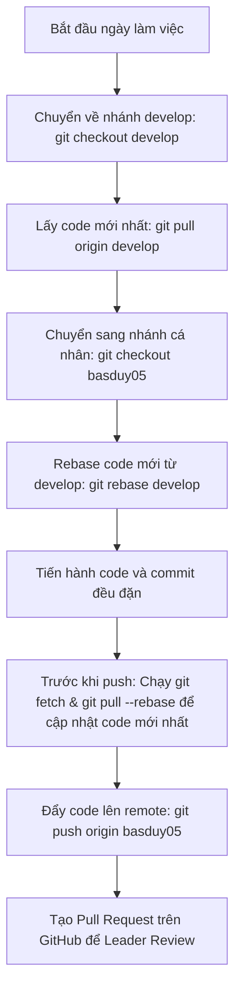

# HƯỚNG DẪN & BÁO CÁO QUY CHUẨN SỬ DỤNG GIT TRONG DOANH NGHIỆP

---

## 1. Giới thiệu chung về Git & Workflow doanh nghiệp
Trong môi trường doanh nghiệp, Git không chỉ đơn thuần là công cụ lưu trữ mã nguồn mà còn là nền tảng quản lý cộng tác giữa nhiều lập trình viên. Để đảm bảo hệ thống vận hành ổn định và code không bị xung đột, các doanh nghiệp thường áp dụng các mô hình Git Workflow tiêu chuẩn như **Git Flow** hoặc **GitHub Flow**.

### Các nhánh chính trong Git Flow
- **`main` / `master`**: Nhánh chứa mã nguồn ổn định nhất, đã qua kiểm thử (testing) và sẵn sàng deploy lên môi trường Production (sản xuất). Nghiêm cấm push trực tiếp lên nhánh này.
- **`develop` / `dev`**: Nhánh tích hợp các tính năng mới từ các developer. Tất cả các nhánh feature sẽ được merge vào đây để kiểm thử tích hợp (Staging/UAT).
- **`feature/` (ví dụ: `feature/basduy05-login`)**: Nhánh con được tách từ `develop` để phát triển một chức năng cụ thể.
- **`hotfix/`**: Nhánh dùng để sửa lỗi khẩn cấp trực tiếp từ `main` và sau đó merge ngược lại vào cả `main` và `develop`.
- **`release/`**: Nhánh chuẩn bị cho việc đóng gói sản phẩm trước khi đưa lên `main`.

---

## 2. Quy chuẩn đặt tên (Naming Conventions)
Đặt tên đúng chuẩn giúp đội ngũ dễ dàng theo dõi tiến độ và quản lý lịch sử commit.

### Quy chuẩn đặt tên Nhánh (Branch Naming)
Cấu trúc khuyến nghị: `<loại-nhánh>/<tên-developer>-<tác-vụ>` hoặc `<loại-nhánh>/<mã-ticket>-<tác-vụ>`
- **Tính năng mới**: `feature/basduy05-auth` hoặc `feature/jira-102-login`
- **Sửa lỗi**: `bugfix/basduy05-fix-layout` hoặc `hotfix/api-timeout`

### Quy chuẩn viết Commit Message (Conventional Commits)
Thông điệp commit nên ngắn gọn, rõ ràng và tuân theo cấu trúc:
`<type>(<scope>): <description>`

Các `<type>` phổ biến:
- `feat`: Tính năng mới (Feature)
- `fix`: Sửa lỗi (Bug fix)
- `docs`: Tài liệu hướng dẫn (Documentation)
- `style`: Thay đổi giao diện, định dạng code (CSS, format, không đổi logic code)
- `refactor`: Tái cấu trúc mã nguồn (không sửa lỗi, không thêm tính năng)
- `test`: Thêm hoặc chỉnh sửa unit test
- `chore`: Các tác vụ nhỏ khác (cập nhật thư viện, cấu hình build...)

*Ví dụ:*
- `feat(auth): thêm chức năng đăng nhập bằng Google`
- `fix(cart): sửa lỗi không cập nhật số lượng sản phẩm`

---

## 3. Các lệnh Git cơ bản và nâng cao (Cheat Sheet)

### Khởi tạo & Lấy code về
| Lệnh | Mô tả |
| :--- | :--- |
| `git clone <url>` | Tải toàn bộ dự án từ repository từ xa về máy cục bộ. |
| `git init` | Khởi tạo một Git repository mới tại thư mục hiện tại. |

### Quản lý thay đổi
| Lệnh | Mô tả |
| :--- | :--- |
| `git status` | Kiểm tra trạng thái các file (đã sửa đổi, chưa track, đã add vào Stage). |
| `git diff` | Xem chi tiết các dòng code thay đổi so với commit gần nhất. |
| `git add <file>` | Đưa file vào khu vực chuẩn bị commit (Staging Area). Dùng `git add .` để add tất cả. |
| `git commit -m "Thông điệp"` | Ghi nhận các thay đổi vào lịch sử Git tại local. |
| `git commit --amend` | Sửa đổi thông điệp hoặc nội dung của commit gần nhất (chỉ dùng khi chưa push lên remote). |

### Quản lý Nhánh (Branch)
| Lệnh | Mô tả |
| :--- | :--- |
| `git branch` | Liệt kê danh sách các nhánh ở local. Dùng `-a` để xem cả remote. |
| `git checkout -b <tên-nhánh>` | Tạo một nhánh mới và chuyển ngay sang nhánh đó. |
| `git checkout <tên-nhánh>` | Chuyển sang nhánh có sẵn. |
| `git switch <tên-nhánh>` | Lệnh mới tương tự checkout dùng để chuyển nhánh. |
| `git branch -d <tên-nhánh>` | Xóa một nhánh local sau khi đã merge xong. |

### Đồng bộ hóa với Remote (GitHub/GitLab)
| Lệnh | Mô tả |
| :--- | :--- |
| `git fetch` | Lấy danh sách các thay đổi mới nhất từ remote về nhưng không gộp vào code hiện tại. |
| `git pull` | Lấy code mới nhất từ remote và tự động gộp (merge) vào nhánh hiện tại. |
| `git pull --rebase` | Lấy code mới và xếp commit của mình lên trên cùng (giúp lịch sử git thẳng và đẹp). |
| `git push origin <tên-nhánh>` | Đẩy nhánh và các commit từ local lên remote repository. |

---

## 4. Quy trình làm việc hàng ngày của Developer (Daily Workflow)
Để tránh xung đột code tối đa, hãy thực hiện quy trình sau mỗi ngày làm việc:



### Chi tiết các bước:
1. **Cập nhật nhánh cơ sở (`develop`)**:
   ```bash
   git checkout develop
   git pull origin develop
   ```
2. **Đồng bộ hóa nhánh làm việc của bạn (`basduy05`)**:
   ```bash
   git checkout basduy05
   git merge develop   # Hoặc dùng git rebase develop để giữ lịch sử sạch đẹp
   ```
3. **Tiến hành lập trình và commit**:
   Nên chia nhỏ công việc thành các commit có nghĩa. Không nên viết code cả ngày rồi tạo duy nhất 1 commit khổng lồ.
   ```bash
   git add .
   git commit -m "feat(product): thêm bộ lọc sản phẩm theo giá"
   ```
4. **Đẩy code lên GitHub**:
   ```bash
   git push origin basduy05
   ```
5. **Tạo Pull Request (PR)**:
   Lên giao diện GitHub, tạo một Pull Request để merge từ nhánh `basduy05` sang nhánh `develop`. Đợi Leader/đồng nghiệp Review code và approve trước khi merge.

---

## 5. Xử lý xung đột code (Resolve Merge Conflicts)
Xung đột xảy ra khi hai người cùng sửa đổi trên cùng một dòng code ở hai nhánh khác nhau và Git không biết nên chọn dòng nào.

### Các bước xử lý:
1. Khi chạy lệnh `git merge` hoặc `git pull`, nếu có thông báo: `CONFLICT (content): Merge conflict in...`
2. Mở file bị conflict bằng VS Code hoặc IDE. Bạn sẽ thấy các phần đánh dấu:
   ```markdown
   <<<<<<< HEAD
   Mã nguồn của bạn (nhánh hiện tại)
   =======
   Mã nguồn của người khác (nhánh merge vào)
   >>>>>>> develop
   ```
3. Thảo luận với đồng nghiệp (người viết đoạn code kia) để chọn giữ lại code nào thích hợp nhất (hoặc gộp cả hai).
4. Xóa các ký tự đánh dấu `<<<<<<<`, `=======`, `>>>>>>>` và lưu file.
5. Đánh dấu file đã giải quyết xung đột và hoàn thành commit:
   ```bash
   git add <tên-file>
   git commit -m "chore: giải quyết xung đột code khi merge develop"
   ```

---

## 6. Các quy tắc "vàng" khi sử dụng Git trong dự án lớn
1. **Không bao giờ push trực tiếp lên `develop` hoặc `main`**: Mọi thay đổi đều phải thông qua Pull Request và được Review.
2. **Luôn chạy dự án và test trước khi commit**: Không commit code lỗi cú pháp hoặc làm hỏng ứng dụng.
3. **Tận dụng `.gitignore`**: Không bao giờ commit các file cấu hình nhạy cảm (`.env`), thư mục cài đặt (`node_modules/`, `vendor/`), hay các file build.
4. **Pull code thường xuyên**: Giúp phát hiện conflict sớm và tránh việc phải sửa một lượng lớn conflict vào cuối sprint.
5. **Viết commit message có nghĩa**: Tránh viết những commit như "update", "fix bug", "done", "asdasd".

---
*Chúc bạn có trải nghiệm làm việc hiệu quả với Git tại dự án!*
