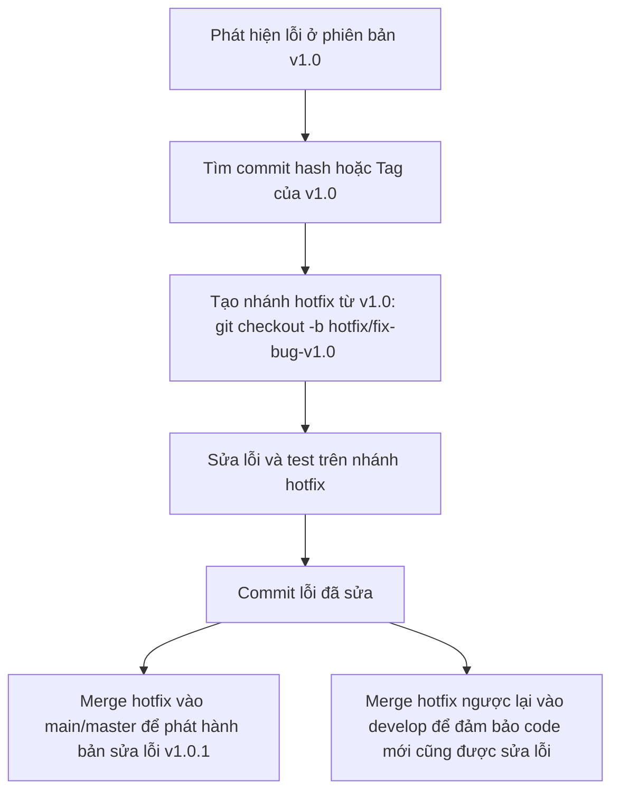
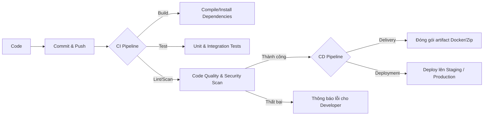

# BÁO CÁO TOÀN DIỆN: QUY CHUẨN GIT NÂNG CAO & HỆ THỐNG CI/CD TRONG DOANH NGHIỆP

---

## PHẦN 1: HƯỚNG DẪN GIẢI QUYẾT XUNG ĐỘT (MERGE CONFLICT) THỰC TẾ

Hiện tại, tôi đã tạo sẵn một **xung đột thực tế (merge conflict)** ngay trên thư mục làm việc của bạn.
* **Nhánh hiện tại:** `conflict-practice-a`
* **Nhánh muốn merge vào:** `conflict-practice-b`
* **Tệp bị xung đột:** [docs/conflict_demo.txt](file:///c:/Users/basduy05/Downloads/cicd/docs/conflict_demo.txt)

### 1. Cách nhận biết Xung đột trong Git
Khi bạn chạy lệnh `git merge conflict-practice-b`, Git sẽ hiển thị thông báo lỗi:
```text
CONFLICT (content): Merge conflict in docs/conflict_demo.txt
Automatic merge failed; fix conflicts and then commit the result.
```
Nếu mở tệp [conflict_demo.txt](file:///c:/Users/basduy05/Downloads/cicd/docs/conflict_demo.txt), bạn sẽ thấy các ký tự đánh dấu xung đột:
```text
Dong 1: Day la dong co ban.
<<<<<<< HEAD
Dong 2: Noi dung duoc sua boi Developer A.
=======
Dong 2: Noi dung duoc sua boi Developer B.
>>>>>>> conflict-practice-b
```
* **`<<<<<<< HEAD`**: Bắt đầu phần thay đổi ở nhánh hiện tại của bạn (`conflict-practice-a`).
* **`=======`**: Ranh giới giữa thay đổi của hai nhánh.
* **`>>>>>>> conflict-practice-b`**: Kết thúc phần thay đổi ở nhánh được merge vào.

### 2. Các bước giải quyết xung đột (Resolve Conflict)
1. **Lựa chọn code giữ lại**: 
   - Mở file [conflict_demo.txt](file:///c:/Users/basduy05/Downloads/cicd/docs/conflict_demo.txt) trên VS Code.
   - VS Code sẽ hiển thị các nút bấm nhanh:
     - *Accept Current Change*: Giữ lại phiên bản của bạn (Developer A).
     - *Accept Incoming Change*: Chọn phiên bản của nhánh merge vào (Developer B).
     - *Accept Both Changes*: Giữ lại cả hai.
2. **Sửa file thủ công**: Xóa tất cả các dòng đánh dấu (`<<<<<<<`, `=======`, `>>>>>>>`) và sửa nội dung code cho đúng logic.
3. **Đánh dấu đã sửa và Commit**:
   ```bash
   git add docs/conflict_demo.txt
   git commit -m "fix(conflict): resolve merge conflict between developer A and B"
   ```
4. **Hủy Merge (nếu muốn làm lại từ đầu)**:
   ```bash
   git merge --abort
   ```

---

## PHẦN 2: CÁCH SỬA LỖI TRÊN MỘT PHIÊN BẢN CŨ/LỖI (HOTFIX WORKFLOW)

Trong thực tế, khi khách hàng báo lỗi ở phiên bản đã deploy (ví dụ: phiên bản v1.0), trong khi nhánh `develop` hiện tại đã đi rất xa và chứa nhiều code mới chưa ổn định, chúng ta không thể fix trực tiếp trên `develop`.

### Quy trình sửa lỗi chuẩn doanh nghiệp (Hotfix):



### Các lệnh thực thi chi tiết:
1. **Kiểm tra lịch sử để tìm Commit lỗi**:
   ```bash
   git log --oneline
   ```
2. **Tạo nhánh hotfix từ Commit hoặc Tag cụ thể**:
   ```bash
   git checkout -b hotfix/cart-error-v1.0 9ae5679  # 9ae5679 là commit hash của bản v1.0
   ```
3. **Sửa code và tạo Commit**:
   ```bash
   git add .
   git commit -m "fix(cart): resolve null pointer exception in checkout"
   ```
4. **Đưa bản sửa lỗi về các nhánh chính**:
   - Merge vào `main` để deploy sửa lỗi ngay lập tức:
     ```bash
     git checkout main
     git merge hotfix/cart-error-v1.0
     git tag -a v1.0.1 -m "Release version 1.0.1 hotfix"
     ```
   - Merge vào `develop` để giữ cho nhánh phát triển có bản sửa lỗi này:
     ```bash
     git checkout develop
     git merge hotfix/cart-error-v1.0
     ```
   - Xóa nhánh hotfix sau khi hoàn thành:
     ```bash
     git branch -d hotfix/cart-error-v1.0
     ```
5. **Trường hợp chỉ muốn lấy 1 commit cụ thể (Cherry-pick)**:
   Nếu bạn chỉ muốn "bốc" duy nhất một commit sửa lỗi từ nhánh này sang nhánh khác mà không muốn merge cả nhánh:
   ```bash
   git checkout develop
   git cherry-pick <commit-hash-sua-loi>
   ```

---

## PHẦN 3: TẠI SAO PULL VỀ ĐƯỢC NHƯNG KHÔNG ĐƯỢC PUSH LÊN?

Đây là một câu hỏi rất phổ biến từ các thầy cô hoặc trong các buổi phỏng vấn.

### 1. Phân quyền truy cập (Read-only vs Write Access)
* **Quyền Read (Pull/Clone)**: Hầu hết các repository dự án của doanh nghiệp hoặc mã nguồn mở đều cho phép thành viên (hoặc cộng đồng) clone/pull về máy để đọc và chạy thử.
* **Quyền Write (Push)**: Chỉ những người được cấp quyền ghi (Collaborator/Maintainer) mới được push trực tiếp lên repository từ xa (remote).

### 2. Quy tắc bảo vệ nhánh (Branch Protection Rules)
Ngay cả khi bạn là thành viên dự án và có quyền Write, doanh nghiệp vẫn sẽ khóa quyền push trực tiếp lên các nhánh chính như `main`, `master`, hoặc `develop`.
* **Mục đích**: Tránh việc lập trình viên vô tình push code lỗi, code chưa qua kiểm thử làm sập hệ thống đang chạy.
* **Cách hoạt động**: Mọi thay đổi bắt buộc phải được đẩy lên một nhánh riêng (như `basduy05`), sau đó tạo **Pull Request (PR)** hoặc **Merge Request (MR)**. Nhánh này cần được duyệt (Approve) bởi tối thiểu 1-2 Senior Developer/Tech Lead và phải vượt qua các bài kiểm tra tự động (CI/CD) mới được merge vào nhánh chính.

---

## PHẦN 4: TỔNG QUAN CHI TIẾT VỀ HỆ THỐNG CI/CD

CI/CD là viết tắt của **Continuous Integration** (Tích hợp liên tục) và **Continuous Delivery / Deployment** (Chuyển giao / Triển khai liên tục). Đây là xương sống của văn hóa DevOps hiện đại.



### 1. Định nghĩa chi tiết
* **CI (Continuous Integration)**: Quy trình tự động xây dựng (Build) và kiểm thử (Test) mã nguồn mỗi khi có một thành viên push code mới lên repository. Giúp phát hiện lỗi tích hợp sớm nhất có thể.
* **CD (Continuous Delivery - Chuyển giao liên tục)**: Sau khi CI thành công, code được tự động đóng gói và chuẩn bị sẵn sàng để deploy. Việc deploy lên môi trường Production sẽ được kích hoạt bằng tay (Manual click).
* **CD (Continuous Deployment - Triển khai liên tục)**: Cao cấp hơn Continuous Delivery. Mọi thay đổi vượt qua các bước test tự động sẽ ngay lập tức được deploy tự động lên môi trường Production mà không cần sự can thiệp của con người.

### 2. Các công cụ CI/CD phổ biến
* **GitHub Actions**: Tích hợp trực tiếp với GitHub, cấu hình qua file YAML, rất phổ biến hiện nay.
* **GitLab CI/CD**: Rất mạnh mẽ, tích hợp sẵn trong GitLab.
* **Jenkins**: Công cụ mã nguồn mở lâu đời, tùy biến cực cao thông qua các plugin nhưng tốn công vận hành.
* **Docker / Kubernetes**: Dùng để đóng gói và vận hành ứng dụng đồng nhất giữa các môi trường.

---

## PHẦN 5: CÁC CÂU HỎI THƯỜNG GẶP (Q&A) VỀ GIT & CI/CD KHI BẢO VỆ DỰ ÁN

Dưới đây là các câu hỏi thầy cô hoặc nhà tuyển dụng thường hỏi xoay quanh Git và CI/CD:

### Nhóm 1: Câu hỏi về Git trong dự án
#### Q1: "Làm thế nào để em merge code từ nhánh cá nhân vào nhánh develop mà không làm hỏng code của người khác?"
* **Trả lời**: Em sẽ chuyển về nhánh `develop`, chạy `git pull` để lấy code mới nhất. Sau đó quay lại nhánh cá nhân chạy `git merge develop` (hoặc `git rebase develop`) để giải quyết mọi xung đột ở local trước. Khi chạy thử ứng dụng không có lỗi, em mới push nhánh cá nhân lên remote và tạo Pull Request để Lead duyệt và merge trên giao diện GitHub.

#### Q2: "Nếu em lỡ commit code nhạy cảm (như mật khẩu, database config) lên GitHub thì làm thế nào?"
* **Trả lời**: Em không thể chỉ dùng commit mới để xóa vì lịch sử commit cũ vẫn lưu mật khẩu đó. Em phải dùng công cụ như `git-filter-repo` hoặc lệnh `git filter-branch` để quét lịch sử và xóa hoàn toàn dấu vết của file đó khỏi lịch sử Git, sau đó sử dụng `git push origin --force` để ghi đè. Sau đó ngay lập tức đổi mật khẩu của database đó để đảm bảo an toàn.

#### Q3: "Phân biệt git merge và git rebase?"
* **Trả lời**: 
  - `git merge`: Tạo ra một commit merge mới để gộp hai nhánh lại với nhau. Nó giữ nguyên lịch sử commit thực tế của cả hai nhánh, tạo ra các đường rẽ nhánh và gộp nhánh trực quan.
  - `git rebase`: Di chuyển điểm bắt đầu của nhánh hiện tại lên đầu nhánh đích. Nó viết lại lịch sử commit làm cho lịch sử Git trở thành một đường thẳng duy nhất, sạch đẹp nhưng có thể gây khó khăn nếu rebase trên các nhánh dùng chung.

---

### Nhóm 2: Câu hỏi về CI/CD
#### Q4: "Tại sao dự án cần CI/CD? Lợi ích thực tế là gì?"
* **Trả lời**: CI/CD giúp giảm thiểu sai sót của con người. Thay vì lập trình viên phải tự build, tự chạy test và tự upload code lên server qua FTP (rất dễ nhầm lẫn), CI/CD tự động hóa toàn bộ quy trình này. Code lỗi sẽ bị chặn ngay từ bước test tự động, giúp sản phẩm luôn ở trạng thái chạy được và rút ngắn thời gian đưa tính năng mới đến người dùng.

#### Q5: "Nếu Pipeline CI/CD bị fail ở bước Test thì quy trình tiếp theo sẽ xử lý thế nào?"
* **Trả lời**: Khi một bước trong Pipeline bị lỗi, toàn bộ quy trình CD phía sau (như đóng gói và deploy) sẽ bị **chặn lại ngay lập tức** để bảo vệ hệ thống hiện tại không bị đè bởi code lỗi. Hệ thống CI/CD sẽ gửi thông báo (email, Slack, Discord) cho lập trình viên vừa push code để họ sửa lỗi và push lại bản sửa lỗi.

#### Q6: "Môi trường Staging và Production trong CD khác nhau thế nào?"
* **Trả lời**: 
  - **Staging**: Là môi trường giả lập, có cấu hình và dữ liệu gần giống hệt Production nhất. Được dùng cho đội ngũ QA/QC và khách hàng chạy thử để nghiệm thu tính năng.
  - **Production**: Môi trường thực tế nơi người dùng cuối đang sử dụng sản phẩm. Yêu cầu tính ổn định cực cao.

#### Q7: "Làm thế nào hệ thống CD deploy code lên server mà không làm gián đoạn người dùng (Zero-downtime deployment)?"
* **Trả lời**: Người ta thường sử dụng các chiến lược deploy nâng cao như:
  - **Blue-Green Deployment**: Duy trì 2 môi trường song song (Blue đang chạy thực tế, Green là bản mới). Khi deploy thành công lên Green và kiểm tra ổn định, router sẽ chuyển hướng toàn bộ traffic người dùng sang Green ngay lập tức.
  - **Canary Deployment**: Deploy bản mới cho một nhóm nhỏ người dùng trước (ví dụ 5%). Nếu không phát hiện lỗi nào, hệ thống sẽ deploy dần dần cho 100% người dùng còn lại.

---
*Báo cáo này được cập nhật đầy đủ để hỗ trợ bạn tối đa trong quá trình học tập và bảo vệ dự án.*
