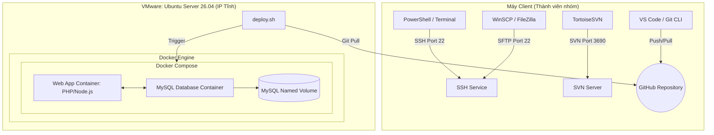

# Hướng Dẫn Chi Tiết & Kịch Bản Demo Dự Án DevOps/SysAdmin

Tài liệu này hướng dẫn chi tiết từ việc thiết lập hạ tầng trên VMware, cấu hình các dịch vụ cơ bản, quản lý mã nguồn, đóng gói Docker cho đến việc tự động hóa CI/CD bằng Shell Script. Ở phần cuối là kịch bản demo chi tiết giúp nhóm bạn đạt điểm tối đa trước hội đồng phản biện.

---

## 🗺️ Sơ Đồ Kiến Trúc Hệ Thống



---

## 📑 PHẦN 1: HƯỚNG DẪN CÀI ĐẶT & CẤU HÌNH CHI TIẾT

### Bước 1: Cài đặt Ubuntu Server trên VMware Workstation

1. **Khởi tạo Máy ảo mới**:
   - Mở VMware Workstation -> Chọn **Create a New Virtual Machine** -> **Typical (recommended)**.
   - Chọn **Installer disc image file (iso)** -> Browse đến file `ubuntu-26.04-live-server-amd64.iso` đã tải.
   - Đặt tên máy ảo (ví dụ: `Ubuntu-Server-DevOps`) và chọn vị trí lưu.
   - Thiết lập cấu hình tối thiểu: **2 vCPUs**, **2GB RAM** (hoặc 4GB nếu máy thật mạnh), **20GB Disk (Store virtual disk as a single file)**.
   - Ở phần Network Adapter: Chọn **Bridge** (nếu muốn máy ảo nhận IP cùng dải với mạng nhà/trường để các máy client khác kết nối trực tiếp) hoặc **NAT** (nếu muốn dùng mạng riêng chia sẻ từ máy chủ). *Khuyến nghị dùng NAT hoặc Bridge phù hợp với môi trường lab mạng của bạn.*
2. **Cài đặt Hệ điều hành**:
   - Khởi động máy ảo. Chọn ngôn ngữ **English**.
   - Phần **Network connections**: Ghi nhận lại tên card mạng (ví dụ: `ens33` hoặc `enp0s3`). Bạn có thể để DHCP tạm thời để tải gói cài đặt, chúng ta sẽ cấu hình IP tĩnh sau.
   - Phần **Proxy** & **Archive Mirror**: Nhấn Enter để tiếp tục.
   - Phần **Storage Configuration**: Chọn **Use an entire disk** -> Nhấn Done.
   - Điền thông tin User (ví dụ: tên `admin`, server name `devops-server`, password `123456`).
   - **Quan trọng**: Tại màn hình **SSH Setup**, bấm Space chọn **[X] Install OpenSSH server** -> Done.
   - Bỏ qua các gói cài đặt bổ sung (Featured Server Snaps) -> Chọn Done và đợi quá trình cài đặt hoàn tất, sau đó chọn **Reboot Now**.

---

### Bước 2: Hạ tầng & Kết nối (SSH, IP Tĩnh, SFTP)

#### 1. Cấu hình IP Tĩnh cho Ubuntu Server
Để đảm bảo IP không bị thay đổi mỗi lần khởi động, ta cấu hình công cụ `netplan`.
Mở file cấu hình mạng bằng lệnh (lưu ý thay `01-netcfg.yaml` bằng tên file tương ứng trong thư mục mạng của bạn):

```bash
sudo nano /etc/netplan/50-cloud-init.yaml
```

Chỉnh sửa nội dung file tương tự cấu trúc sau (lưu ý căn lề bằng 2 hoặc 4 khoảng trắng, **không dùng phím Tab**):

```yaml
network:
  ethernets:
    ens33: # Thay đổi đúng tên card mạng của bạn
      dhcp4: no
      addresses:
        - 192.168.1.100/24 # Đặt IP tĩnh cho Server của bạn
      routes:
        - to: default
          via: 192.168.1.1 # IP Router (Gateway) của bạn
      nameservers:
        addresses:
          - 8.8.8.8
          - 1.1.1.1
  version: 2
```

Lưu file (`Ctrl + O`, `Enter`, `Ctrl + X`) và áp dụng cấu hình:
```bash
sudo netplan apply
```
*Kiểm tra lại IP bằng lệnh:* `ip a`

#### 2. Kích hoạt và kiểm tra SSH
Mặc định SSH đã được cài đặt. Để đảm bảo dịch vụ luôn chạy cùng hệ thống:
```bash
sudo systemctl enable ssh
sudo systemctl start ssh
sudo systemctl status ssh
```
**Mẹo bảo mật**: Bạn có thể đổi cổng SSH mặc định từ 22 sang một cổng khác (ví dụ: 2222) trong file `/etc/ssh/sshd_config`, tuy nhiên trong bài lab học tập này, giữ nguyên port 22 để đồng bộ với SFTP là tối ưu nhất.

#### 3. Cài đặt và cấu hình vsftpd (FTP Server)
Cài đặt dịch vụ FTP truyền thống:
```bash
sudo apt update
sudo apt install vsftpd -y
```
Cấu hình cho phép ghi dữ liệu:
```bash
sudo nano /etc/vsftpd.conf
```
Tìm các dòng sau và mở khóa (bỏ dấu `#` ở đầu) hoặc sửa lại thành:
```conf
write_enable=YES
local_enable=YES
```
Lưu lại và khởi động lại dịch vụ:
```bash
sudo systemctl restart vsftpd
sudo systemctl enable vsftpd
```

> [!IMPORTANT]
> **Điểm cộng thuyết trình**: Hãy chuẩn bị câu hỏi thảo luận với giảng viên. *Tại sao ngày nay doanh nghiệp dùng SFTP thay vì FTP?*
> - **FTP (Port 21)** gửi thông tin đăng nhập và dữ liệu dưới dạng văn bản thuần (clear text), rất dễ bị bắt gói tin (Sniffing).
> - **SFTP (SSH File Transfer Protocol - Port 22)** mã hóa toàn bộ dữ liệu truyền và thông tin đăng nhập qua kênh SSH an toàn.

---

### Bước 3: Quản lý tài liệu dự án bằng SVN (Subversion)

Mặc dù Git rất mạnh về quản lý mã nguồn, nhưng đối với các tài liệu dự án có dung lượng lớn, định dạng nhị phân khó merge (như file `.docx`, `.xlsx`, `.pdf`, file thiết kế Photoshop/Figma `.fig`), việc dùng SVN (Subversion) giúp lưu trữ tập trung và tránh làm nặng lịch sử Git (Git Repository Cloned size).

#### 1. Cài đặt SVN trên Ubuntu Server
```bash
sudo apt install subversion apache2 libapache2-mod-svn -y
```

#### 2. Tạo Repository chung cho nhóm
Tạo thư mục lưu trữ và khởi tạo Repository:
```bash
sudo mkdir -p /var/svn
sudo svnadmin create /var/svn/project_docs
```

#### 3. Phân quyền User và phân quyền truy cập
Mở file cấu hình bảo mật cục bộ của SVN để tạo tài khoản truy cập nhanh gọn:
```bash
sudo nano /var/svn/project_docs/conf/svnserve.conf
```
Bỏ dấu `#` ở đầu các dòng sau để kích hoạt xác thực:
```conf
anon-access = none
auth-access = write
password-db = passwd
authz-db = authz
```

Mở file định nghĩa mật khẩu người dùng:
```bash
sudo nano /var/svn/project_docs/conf/passwd
```
Thêm tài khoản cho các thành viên nhóm ở cuối file:
```ini
[users]
admin = matkhau123
devops = matkhau456
developer = matkhau789
```

Khởi chạy tiến trình dịch vụ SVN Server lắng nghe cổng 3690:
```bash
sudo svnserve -d -r /var/svn
```

#### 4. Sử dụng máy Client (Windows) kết nối qua TortoiseSVN
- Tải và cài đặt **TortoiseSVN** trên Windows.
- Nhấp chuột phải vào thư mục trống trên máy tính -> Chọn **SVN Checkout**.
- Nhập URL: `svn://192.168.1.100/project_docs` (Thay bằng IP tĩnh của Server của bạn).
- Nhập User/Password đã cấu hình để tải tài liệu về hoặc cập nhật tài liệu lên Server.

---

### Bước 4: Quản lý mã nguồn (Git & GitHub)

Quy trình làm việc nhóm chuyên nghiệp sử dụng mô hình **Git Branching Strategy**.

```
  main      ━━━━━━━━━━━━━━━━━━━━━━━━━━━━━━━━━━━━━━━━━━━━━━━━ (Production)
               ▲
               │ (Pull Request/Merge)
  develop   ━━━┻━━━━━━━━━━━━━━━━━┳━━━━━━━━━━━━━━━━━━━━━━━━━━━━━ (Staging/Testing)
                           ▲     │
              (Create Branch)    ▼ (Conflict Test Branch)
  feature   ━━━━━━━━━━━━━━━┻━━━━━┻━━━━━━━━━━━━━━━━━━━━━━━━━━━━ (Feature Development)
```

#### 1. Cấu hình ban đầu trên máy Client
Cài đặt Git và cấu hình thông tin cá nhân:
```bash
git config --global user.name "Ho va Ten"
git config --global user.email "email@example.com"
```

#### 2. Quy trình làm việc nhóm
1. Tạo một Repository trên GitHub (ví dụ: `my-web-app`).
2. Thành viên 3 (Developer) clone repo về máy:
   ```bash
   git clone https://github.com/username/my-web-app.git
   cd my-web-app
   ```
3. Tạo nhánh phát triển `develop`:
   ```bash
   git checkout -b develop
   git push origin develop
   ```
4. Khi làm tính năng mới, tạo nhánh nhánh con từ `develop`:
   ```bash
   git checkout -b feature/login
   ```
5. Viết code, commit và gửi Pull Request (PR) về nhánh `develop` trên GitHub.

#### 3. Tạo tình huống Xung đột (Conflict) giả định & Cách xử lý
Đây là phần giảng viên cực kỳ thích xem học sinh giải quyết trực tiếp.
* **Tạo Conflict**:
  - **Thành viên A** sửa dòng 10 trong file `index.html` thành `<h1>Chào mừng bạn đến với Web App A</h1>`, commit và push trực tiếp lên nhánh `develop`.
  - **Thành viên B** (chưa pull code mới nhất) cũng sửa dòng 10 trong file `index.html` trên máy mình thành `<h1>Chào mừng bạn đến với Web App B</h1>`, commit và thực hiện `git push`.
  - Git sẽ từ chối và yêu cầu pull về. Khi Thành viên B chạy lệnh `git pull origin develop`, màn hình sẽ xuất hiện thông báo `CONFLICT (content): Merge conflict in index.html`.
* **Giải quyết Conflict**:
  - Mở file `index.html` bằng **VS Code**.
  - VS Code sẽ hiển thị giao diện trực quan với các nút: *Accept Current Change* (giữ lại code của mình), *Accept Incoming Change* (lấy code mới của người khác), hoặc *Accept Both Changes*.
  - Sửa lại nội dung cuối cùng thống nhất giữa hai thành viên, lưu file.
  - Chạy lệnh hoàn tất merge:
    ```bash
    git add index.html
    git commit -m "Fix merge conflict in index.html"
    git push origin develop
    ```

---

### Bước 5: Đóng gói Ứng dụng bằng Docker & Dockerfile

Đóng gói ứng dụng web giúp đảm bảo ứng dụng chạy đồng nhất từ máy lập trình (Client) đến máy chủ deploy (Ubuntu Server).

#### 1. Cài đặt Docker và Docker Compose trên Ubuntu Server
Cài đặt các thư viện cần thiết và thiết lập Docker Repository:
```bash
sudo apt update
sudo apt install ca-certificates curl gnupg lsb-release -y
sudo mkdir -p /etc/apt/keyrings
curl -fsSL https://download.docker.com/linux/ubuntu/gpg | sudo gpg --dearmor -o /etc/apt/keyrings/docker.gpg

echo \
  "deb [arch=$(dpkg --print-architecture) signed-by=/etc/apt/keyrings/docker.gpg] https://download.docker.com/linux/ubuntu \
  $(lsb_release -cs) stable" | sudo tee /etc/apt/sources.list.d/docker.list > /dev/null

sudo apt update
sudo apt install docker-ce docker-ce-cli containerd.io docker-compose-plugin -y
```

#### 2. Xây dựng cấu trúc Web Application mẫu
Tạo thư mục dự án trên Server (hoặc trên GitHub clone về):
```bash
mkdir -p ~/my-web-app
cd ~/my-web-app
```

Tạo file ứng dụng Node.js đơn giản `server.js` (hoặc PHP tương ứng):
```javascript
const express = require('express');
const mysql = require('mysql2');

const app = express();
const PORT = 3000;

// Cấu hình kết nối MySQL sử dụng biến môi trường
const db = mysql.createConnection({
  host: process.env.DB_HOST || 'db',
  user: process.env.DB_USER || 'root',
  password: process.env.DB_PASSWORD || 'secret',
  database: process.env.DB_NAME || 'testdb'
});

db.connect((err) => {
  if (err) {
    console.error('Lỗi kết nối MySQL: ' + err.stack);
    return;
  }
  console.log('Đã kết nối thành công tới Database MySQL.');
});

app.get('/', (req, res) => {
  res.send('<h1>Chào mừng bạn đến với Web App chạy Docker Container!</h1><p>Kết nối CSDL: OK</p>');
});

app.listen(PORT, () => {
  console.log(`Ứng dụng đang chạy trên cổng ${PORT}`);
});
```

Tạo file `package.json` định nghĩa các gói thư viện:
```json
{
  "name": "my-web-app",
  "version": "1.0.0",
  "main": "server.js",
  "dependencies": {
    "express": "^4.19.2",
    "mysql2": "^3.9.7"
  }
}
```

#### 3. Viết Dockerfile tối ưu
Tạo file `Dockerfile` trong thư mục dự án:
```dockerfile
# Sử dụng base image nhẹ nhất có thể để giảm dung lượng
FROM node:18-alpine

# Thiết lập thư mục làm việc trong container
WORKDIR /usr/src/app

# Sao chép package.json trước để tận dụng cơ chế lưu cache layer của Docker
COPY package*.json ./

# Cài đặt thư viện dependencies không bao gồm devDependencies (để tối ưu kích thước)
RUN npm install --only=production

# Sao chép toàn bộ mã nguồn vào container
COPY . .

# Mở cổng kết nối ra ngoài container
EXPOSE 3000

# Lệnh khởi chạy ứng dụng
CMD ["node", "server.js"]
```

> [!TIP]
> **Giải thích cơ chế Layer của Dockerfile cho Giảng viên**:
> Mỗi dòng lệnh trong Dockerfile tạo ra một Read-Only Layer. Bằng cách đặt lệnh `COPY package*.json ./` và `RUN npm install` lên trước khi sao chép toàn bộ code (`COPY . .`), Docker sẽ lưu cache tiến trình cài đặt thư viện (`node_modules`). Lần sau khi lập trình viên chỉ sửa đổi code JS, Docker sẽ bỏ qua bước cài đặt thư viện giúp build nhanh gấp 10 lần.

---

### Bước 6: Triển khai Hệ thống bằng Docker Compose & Persistent Volume

Docker Compose giúp chúng ta quản lý đồng thời hai container (Web và MySQL) dễ dàng bằng một cấu hình duy nhất.

Tạo file `docker-compose.yml`:
```yaml
version: '3.8'

services:
  web:
    build: .
    ports:
      - "8080:3000" # Map cổng 8080 của máy vật lý vào cổng 3000 trong container
    environment:
      - DB_HOST=db
      - DB_USER=root
      - DB_PASSWORD=my_strong_pwd
      - DB_NAME=company_db
    depends_on:
      - db # Đảm bảo container db khởi động trước web

  db:
    image: mysql:8.0
    restart: always
    environment:
      MYSQL_ROOT_PASSWORD: my_strong_pwd
      MYSQL_DATABASE: company_db
    ports:
      - "3306:3306"
    volumes:
      - mysql_data:/var/lib/mysql # Sử dụng Named Volume để bảo toàn dữ liệu

volumes:
  mysql_data: # Khai báo Named Volume bền vững
```

---

### Bước 7: Tự động hóa CI/CD bằng Shell Script (Điểm cộng tối đa)

Chúng ta sẽ viết một script tự động cập nhật hệ thống mỗi khi có thay đổi code đẩy lên GitHub.

#### 1. Tạo file shell script `deploy.sh`
```bash
nano deploy.sh
```
Nội dung script:
```bash
#!/bin/bash

echo "============================================="
echo "BẮT ĐẦU TIẾN TRÌNH TỰ ĐỘNG CẬP NHẬT ỨNG DỤNG"
echo "============================================="

# 1. Pull code mới nhất từ nhánh develop của GitHub
echo ">>> Đang lấy code mới từ Github..."
git pull origin develop

# 2. Xây dựng lại container và khởi chạy ngầm
echo ">>> Đang rebuild và tái khởi động ứng dụng..."
docker compose up -d --build

# 3. Dọn dẹp các image/container rác (dangling) để tiết kiệm ổ cứng
echo ">>> Đang tối ưu bộ nhớ ổ cứng..."
docker image prune -f

echo "============================================="
echo "CẬP NHẬT THÀNH CÔNG! HỆ THỐNG ĐÃ SẴN SÀNG."
echo "============================================="
```

#### 2. Phân quyền thực thi cho Script
```bash
chmod +x deploy.sh
```

---

## 🎭 PHẦN 2: KỊCH BẢN THUYẾT TRÌNH & DEMO TẠO ẤN TƯỢNG VỚI GIẢNG VIÊN

Kịch bản demo được thiết kế để tất cả các thành viên đều có đất diễn, chứng minh năng lực kỹ thuật và giải quyết các bài toán thực tế.

### Phân công vai diễn trong nhóm:
* **Thành viên 1 (DevOps/SysAdmin)**: Phụ trách cấu hình mạng, SSH, FTP/SFTP, Docker Compose, Volume và Script Deploy.
* **Thành viên 2 (Git/SVN Master)**: Phụ trách cài đặt SVN Server, hướng dẫn quản lý tài liệu và quản trị Repository.
* **Thành viên 3 (Developer)**: Phụ trách Code Web, đóng gói Dockerfile và demo xử lý Git Conflict trực tiếp.

---

### 🎬 TIẾN TRÌNH KỊCH BẢN DEMO

#### Phân đoạn 1: Demo Hạ tầng & Kết nối (Thành viên 1 trình bày - 3 phút)
1. **Thao tác**: Thành viên 1 mở PowerShell hoặc Terminal từ máy tính của mình. Thực hiện lệnh kết nối vào máy chủ:
   ```bash
   ssh admin@192.168.1.100
   ```
2. **Hành động & Lời nói**: 
   * "Em xin phép được truy cập trực tiếp vào máy chủ Ubuntu đang chạy trên ảo hóa VMware của nhóm. Việc cấu hình IP tĩnh giúp các dịch vụ như web server, cơ sở dữ liệu và SVN chạy ổn định mà không bị đổi địa chỉ."
   * Show thông tin IP tĩnh: `ip a` (Trực quan hóa địa chỉ `192.168.1.100`).
3. **Ấn tượng chuyên môn**: 
   * "Thưa thầy/cô, để bảo mật quản lý tập tin trên Server, thay vì sử dụng FTP truyền thống truyền dữ liệu dạng văn bản không mã hóa qua cổng 21, nhóm em cấu hình giao thức SFTP qua cổng 22. Toàn bộ thông tin đăng nhập và file tải lên đều được mã hóa bảo mật tuyệt đối."

#### Phân đoạn 2: Quản lý tài liệu dự án bằng SVN (Thành viên 2 trình bày - 3 phút)
1. **Thao tác**: Thành viên 2 mở máy tính cá nhân, mở thư mục tài liệu dự án. 
   - Nhấn chuột phải -> Chọn **SVN Update** -> Thêm 1 file tài liệu mới (ví dụ `DAC_TA_YEU_CAU.docx`) -> Nhấn **SVN Commit**.
2. **Hành động & Lời nói**: 
   * "Tại sao nhóm em lại dùng SVN song song với Git? Git rất tốt cho quản lý code dạng text, nhưng đối với các file Word, Excel, file ảnh mockup dung lượng lớn, nếu đưa lên Git sẽ khiến dung lượng repo tải về cực kỳ nặng và không thể giải quyết xung đột dòng lệnh."
   * "Vì vậy, em đã cài đặt dịch vụ SVN trên Server. Các thành viên có thể checkout tài liệu thiết kế và đặc tả về máy cá nhân của mình thông qua TortoiseSVN một cách tập trung, nhanh chóng."

#### Phân đoạn 3: Phân nhánh Git & Giải quyết Xung đột Trực tiếp (Thành viên 3 trình bày - 4 phút)
1. **Thao tác**: Thành viên 3 mở VS Code. Mở file `index.html`.
2. **Hành động & Lời nói**:
   * "Bây giờ em sẽ minh họa trực tiếp cách nhóm xử lý một vấn đề thường gặp khi làm việc nhóm: Xung đột mã nguồn (Merge Conflict)."
   * Thực hiện lệnh `git checkout -b feature/edit-title` từ nhánh phát triển. Sửa tiêu đề trang web.
   * Chạy lệnh `git pull` để nhận code mới nhất từ bạn cùng nhóm, xuất hiện lỗi Conflict trên file.
   * Dùng VS Code chọn *Accept Incoming Change* để gộp code thông minh -> Commit và Push.
   * "Bằng cách sử dụng quy trình phân nhánh rõ ràng (`main` cho môi trường chạy thật, `develop` để kiểm thử phần mềm, và các nhánh `feature` để lập trình tính năng cô lập), nhóm em đã giảm thiểu tối đa rủi ro hỏng code của nhau."

#### Phân đoạn 4: Đóng gói và chạy ứng dụng bằng Docker Compose (Thành viên 1 + 3 - 3 phút)
1. **Thao tác**: Thành viên 1 truy cập SSH Server, di chuyển tới thư mục dự án và chạy lệnh khởi động ứng dụng:
   ```bash
   docker compose up -d
   ```
2. **Hành động & Lời nói**:
   * "Ứng dụng web Node.js kết nối với cơ sở dữ liệu MySQL đã được đóng gói gọn gàng bằng Docker Compose. Thay vì phải cài thủ công MySQL, cấu hình user/pass phức tạp trên OS, giờ đây chỉ cần một file cấu hình duy nhất."
   * Mở trình duyệt trên máy thật, truy cập IP: `http://192.168.1.100:8080` hiển thị trang web kết nối CSDL thành công.

#### Phân đoạn 5: Thử thách của Giảng viên - Kiểm chứng Volume Bền vững (Thành viên 1 - 2 phút)
1. **Mục tiêu**: Lấy điểm 10 tuyệt đối bằng cách chứng minh Named Volume lưu trữ dữ liệu bền vững.
2. **Thao tác**:
   - Truy cập vào trang web, thêm mới một bản ghi hoặc đăng ký tài khoản (dữ liệu được ghi vào MySQL container).
   - Trên Terminal Server, chạy lệnh xóa sạch container:
     ```bash
     docker compose down
     ```
   - F5 trình duyệt để giảng viên thấy trang web **không hoạt động** nữa (máy chủ đã tắt).
   - Khởi động lại:
     ```bash
     docker compose up -d
     ```
   - F5 trình duyệt, trang web hoạt động bình thường và **dữ liệu đăng ký vừa rồi vẫn còn nguyên vẹn**.
3. **Lời nói**:
   * "Thưa thầy cô, điểm mấu chốt ở đây là khi container MySQL bị tắt hoặc bị xóa hoàn toàn, dữ liệu của khách hàng vẫn được giữ nguyên nhờ cơ chế **Named Volume** trỏ trực tiếp từ ổ cứng thực tế của máy chủ ảo Ubuntu vào container. Dữ liệu không bao giờ bị mất đi khi bảo trì hệ thống."

#### Phân đoạn 6: Demo Tự động hóa Nâng cao (Cả nhóm phối hợp - 3 phút)
1. **Thao tác**:
   - Thành viên 3 (Developer) sửa nhanh nội dung trang web trên máy cá nhân, ví dụ đổi màu nền hoặc đổi text của trang chủ. Commit và Push lên nhánh `develop` của GitHub.
   - Thành viên 1 (DevOps) trên Server chạy duy nhất 1 lệnh:
     ```bash
     ./deploy.sh
     ```
2. **Hành động & Lời nói**:
   * "Cuối cùng, để hướng tới mục tiêu tự động hóa (CI/CD), nhóm em thiết kế một file shell script `deploy.sh` kích hoạt trực tiếp từ Server."
   * Màn hình Terminal sẽ hiển thị quá trình tự động `git pull` code mới về và rebuild lại docker image trong 15-20 giây.
   * Thành viên 1 mở trình duyệt máy chủ F5, giao diện lập tức thay đổi theo code mới của Thành viên 3.
   * "Như thầy/cô đã thấy, lập trình viên chỉ cần đẩy code, Server sẽ tự động chạy script, lấy code mới, đóng gói lại và cập nhật hệ thống chạy mà không làm gián đoạn người dùng quá lâu. Đây là bước đệm cơ bản để xây dựng hệ thống CI/CD hoàn thiện trong doanh nghiệp."

---

## 🏆 KẾT LUẬN & ĐÁP ỨNG TIÊU CHÍ ĐIỂM SỐ
Hệ thống demo này đáp ứng toàn diện tất cả các tiêu chí của hội đồng:
1. **Hạ tầng mạng**: Cấu hình mạng bài bản, bảo mật.
2. **Quản trị**: Phối hợp nhuần nhuyễn giữa Git (code) và SVN (tài liệu nhị phân).
3. **Hiện đại hóa**: Sử dụng Docker container hóa ứng dụng để dễ dàng mở rộng và di trú.
4. **Volume và Data**: Xử lý xuất sắc bài toán dữ liệu bền vững của Container.
5. **CI/CD & Shell Script**: Tạo điểm cộng lớn bằng tư duy tự động hóa chuyên nghiệp.
